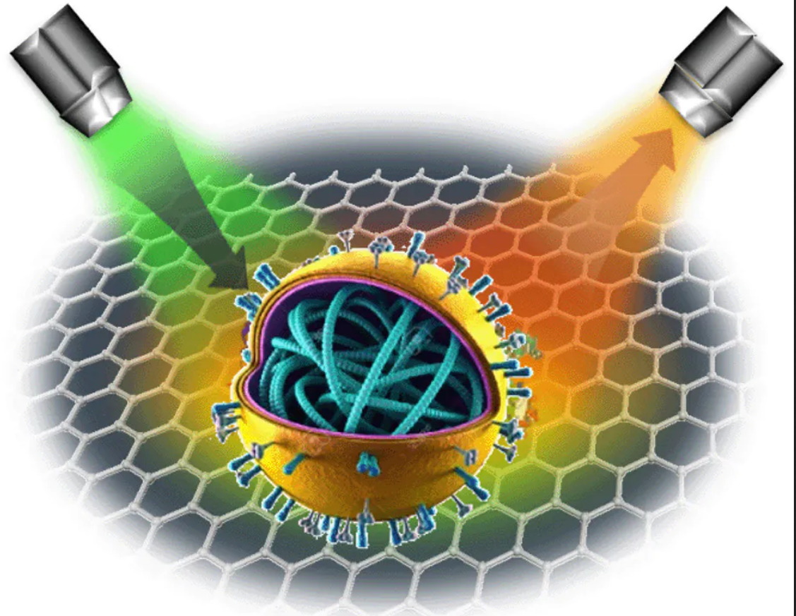

# raman_covid

**A Lasso regularized Logistic Regression model to detect COVID-19 from Raman spectroscopy dataset**

This project is regarding a Lasso Regularized Logistic Regression model intended to detect covid-19 from Raman spectroscopy. 

**Motivation** 

One of the most challenging aspects of the COVID-19 pandemic has been the lack of testing needed to detect and trace infections. Many tests use biochemicals that can be expensive and difficult to produce. These tests can require long turnaround times for test results and can produce a high number of false negative results. 

The principal diagnosis method for SARS-CoV-2 is a PCR technique, which allows for the detection of a genetic material of a pathogen or microorganism and it has high specificity, sensitivity and helps diagnosing even in the first stages of infection. However, it is not the fastest method to use in this situation and it's very time consuming.

Raman spectroscopy could be used as a cheap and quick method to diagnose infection by SARS-CoV-2.

**Source of the Dataset used in this project**

The source of this data was found in the following DOI: https://doi.org/10.6084/m9.figshare.12159924.v1

**Approach**  :
As the number of features was very large compared to number of observations , we resorted to Lasso regession to avoid overfitting . 
The model is initialized with  liblinear solver along with L1 (lasso) penalty. 

The model acheived 97% accuracy on test dataset . 

Classification report for test-dataset is as follows :
              precision    recall  f1-score   support

     Healthy       1.00      0.95      0.97        19
  SARS-CoV-2       0.95      1.00      0.97        19

    accuracy                           0.97        38
   macro avg       0.97      0.97      0.97        38
weighted avg       0.97      0.97      0.97        38

The confusion matrix on test dataset :

**Acknowledgements** :

Yin, Gang; Li, Lintao; Lu, Shun; Yin, Yu; Su, Yuanzhang; Zeng, Yilan; et al. (2020): Data and code on serum Raman spectroscopy as an efficient primary screening of coronavirus disease in 2019 (COVID-19). figshare. Dataset. https://doi.org/10.6084/m9.figshare.12159924.v1

